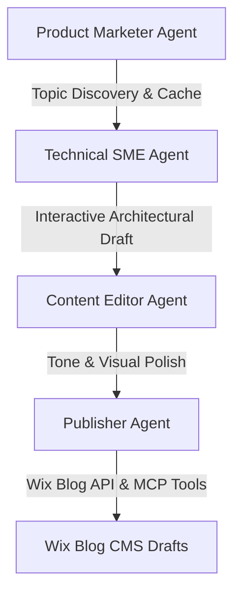

# Kordic Hub Content Engine

The **Kordic Hub Content Engine** is an automated, multi-agent thought leadership content pipeline built with the **Google Antigravity SDK** and custom **Model Context Protocol (MCP)** integrations. 

Designed for a professional services firm, this engine autonomously scans high-volume search trends, drafts detailed technical architectures, refines content to match Kordic's gritty brand voice, and publishes formatted draft posts directly to a **Wix Blog CMS**.

---

## 🤖 Multi-Agent Architecture

The engine coordinates four specialized agents using a collaborative human-in-the-loop workflow:



1. **Product Marketer Agent**: Scans search trends and prioritizes key industry topics based on keyword volume and target persona friction. Caches discovered topics locally for 14 days to optimize performance.
2. **Technical Subject Matter Expert (SME) Agent**: Drafts detailed, factual implementation blueprints. Integrates an interactive command loop allowing humans to refine the technical drafts before hand-off.
3. **Content Editor Agent**: Rewrites the copy to match Kordic's authentic, gritty tone. Enforces stylistic constraints (word count, word/adjective blacklists, 8th-grade readability context, and image layouts).
4. **Publisher Agent**: Converts polished markdown into Wix's structured **Ricos Rich Content** format, imports external images into the Wix Media Manager, and uploads draft posts directly without duplicate blocks or page templates.

For a detailed view of the system components and state transitions, see the full [Architecture Walkthrough (architecture_diagram.md)](file:///Users/jessicapiikkila/Documents/kordic-ai-agent/architecture_diagram.md).

---

## ⚙️ Prerequisites & Setup

### 1. Requirements
- **Python 3.10+**
- **pip** package manager

### 2. Install Dependencies
Install the required packages:
```bash
pip install requests python-dotenv
```
*(Note: Ensure the `google-antigravity` package is installed and configured in your Python environment).*

### 3. Environment Configuration (`.env`)
Create a `.env` file in the root directory:
```env
# Google Gemini API key
GEMINI_API_KEY=your_gemini_api_key_here

# Mode Configuration (set to true to run safe offline tests)
MOCK_MODE=false

# Wix Site Settings
WIX_ACCOUNT_ID=your_wix_account_id
WIX_SITE_ID=your_wix_site_id
WIX_API_KEY=your_wix_api_key

# Creator contact
CREATOR_EMAIL=jpiikkila@kordic.ai
```

---

## 🚀 Quickstart & Testing Guide

### 1. Zero-Configuration Local Testing (Mock Mode)
To run the entire multi-agent pipeline offline without requiring live Gemini API keys or Wix credentials:
1. Ensure `MOCK_MODE=true` is set in your `.env` file (or keep the `GEMINI_API_KEY` unset/default, which automatically triggers mock mode).
2. Start the interactive pipeline:
   ```bash
   python3 main.py
   ```
3. The engine will load topics, prompt you for selection, run interactive revision loops for the SME/Editor agents (where you can type feedback or press Enter/Transition commands), and simulate Wix publishing.

### 2. Standalone Publishing Run
To run standalone publishing scripts directly (e.g. for the auditing compliance whitepaper):
```bash
python3 publish_compliance_whitepaper.py
```
*(Note: These scripts run in mock mode if `MOCK_MODE=true` or if API keys are missing).*

### 3. Run the Automated Test Suite
To run the full suite of unit tests verifying database logic, topic parsing, non-skipping duplication policies, and pipeline loops:
```bash
python3 -m unittest test_pipeline.py
```
or:
```bash
python3 test_pipeline.py
```
All 12 tests are mocked to execute safely and clean up their temporary database files (`test_kordic.db`) afterwards.

---

## 🔒 Security & Declarative Authorization

The content engine implements a **Declarative Authorization System** to govern tool executions. Each agent configuration declares its minimum tool scopes:
- **Product Marketer & SME**: `policy.approve_scopes([])` (no tools permitted).
- **Content Editor**: `policy.approve_scopes(["generate_image"])` (only allowed to run `generate_image`).
- **Publisher**: `policy.approve_scopes(["wix-mcp/*"])` (only allowed to run Wix-related MCP tools).

This prevents rogue execution or privilege escalation while enabling fully autonomous backend tasks. All interactive content checkpoints remain under human command.
