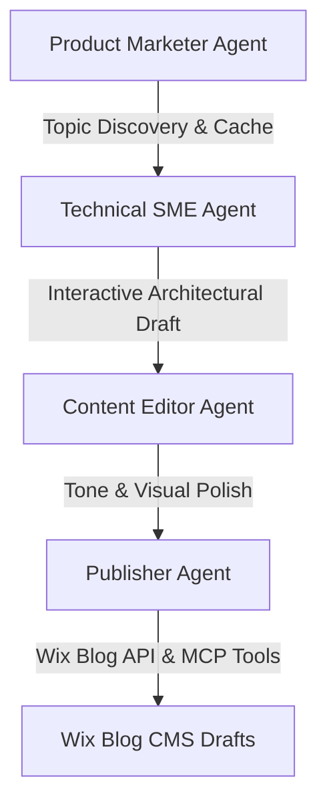

# Kordic Hub Content Engine

The **Kordic Hub Content Engine** is an automated, multi-agent thought leadership content pipeline built with the **Google Antigravity SDK** and custom **Model Context Protocol (MCP)** integrations. 

Designed for a professional services firm, this engine autonomously scans high-volume search trends, drafts detailed technical architectures, refines content to match Kordic's gritty brand voice, and publishes formatted draft posts directly to a **Wix Blog CMS**.

---

## 🤖 Multi-Agent Architecture

The engine coordinates four specialized agents using a collaborative human-in-the-loop workflow:



1. **Product Marketer Agent**: Scans search trends and prioritizes key industry topics based on keyword volume and target persona friction. Caches discovered topics locally for 14 days to optimize performance.
2. **Technical Subject Matter Expert (SME) Agent**: Drafts detailed, factual implementation blueprints (e.g., architecture charts, prerequisites, steps, payload specs). Integrates an interactive command loop allowing humans to refine the technical drafts before hand-off.
3. **Content Editor Agent**: Rewrites the summary/editorial copy to match Kordic's authentic, gritty tone. Enforces stylistic constraints (word count, word/adjective blacklists, 8th-grade readability context, and image layouts).
4. **Publisher Agent**: Converts the polished markdown into Wix's structured **Ricos Rich Content** format, automatically checks for duplicates on the live Wix site, imports external images into the Wix Media Manager, and uploads draft posts.

---

## 🛠️ Key Features

* **Wix Blog Integration via MCP**: Employs standard Wix Blog API methods (`ListWixSites`, `ManageWixSite`, `UploadImageToWixSite`, `draft-posts`) for automated publishing.
* **Automatic Media Processing**: The Publisher Agent downloads external assets locally, encodes them to base64, and imports them to the Wix Media Manager, ensuring zero broken image links on your live blog.
* **Visual Execution Logging**: Features full CLI color-coded tracking to provide real-time status updates:
  * `[⚡ RUNNING]` Phase entry and execution checkpoints.
  * `[🤖 GEMINI API]`/`[⏳ WAITING]` Live Google Gemini model calls and network activity.
  * `[⚙️ MCP TOOL]` Active tool invocation and payload details.
  * `[❌ ERROR]` Visual error tracking and exception traceback.
* **Local Database & Cache Management**: Uses SQLite to track all generated posts, preventing duplicate uploads and maintaining a chronological history sorted by freshness.

---

## ⚙️ Setup & Installation

### 1. Requirements
Ensure you have Python 3.10+ installed. Install the required dependencies:
```bash
pip install requests python-dotenv
```
*(Note: Ensure the `google-antigravity` package is installed and configured in your Python environment).*

### 2. Configuration (`.env`)
Create a `.env` file in the root directory:
```env
# Google Gemini API key
GEMINI_API_KEY=your_gemini_api_key_here

# Mode Configuration (set to true to run safe offline tests)
MOCK_MODE=false

# Wix Site Settings
WIX_ACCOUNT_ID=your_wix_account_id
WIX_SITE_ID=your_wix_site_id
WIX_API_KEY=your_wix_api_key

# Creator contact
CREATOR_EMAIL=jpiikkila@kordic.ai
```

### 3. Running the Pipeline
Run the main script directly from your terminal:
```bash
python3 main.py
```

---

## 🧪 Verification & Testing
To run the pipeline verification tests:
```bash
python3 test_pipeline.py
```
This runs validation checks to ensure instructions are loaded, drafts are parsed, duplicates are correctly handled, and Ricos schemas format correctly.
