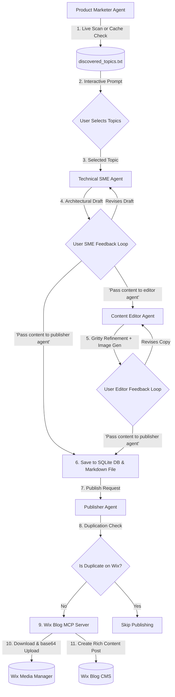

# Kordic Content Engine Architecture & Workflow

This document describes the multi-agent orchestration architecture, data flows, and authorization boundaries that make up the Kordic Content Automation Engine.

## Orchestration Architecture Diagram

Below is a diagram of the system showing the interactions between the agents, the user's interactive checkpoints, local SQLite caching, and the external Wix CMS API via MCP.

---

## Component Workflows

### 1. Product Marketer (Trend Discovery)
- **Purpose**: Identifies high-value topics in four core verticals.
- **Cache Policy**: Checks `discovered_topics.txt` first. Performs fresh scans only if the cache is >14 days old.
- **Human Checkpoint**: Presents discovered topics to the user in a styled list. The user selects which topics to process.

### 2. Technical SME (Architectural Design)
- **Purpose**: Outlines concrete technical steps, payloads, and prerequisites.
- **Human Checkpoint**: Iteratively refines the draft based on user feedback. Transitions when the user inputs `"Pass content to editor agent"` or `"Pass content to publisher agent"`.

### 3. Content Editor (Brand and Style Compliance)
- **Purpose**: Standardizes titles, enforces the gritty Kordic voice, strips jargon/blacklisted words, and generates 3 mandatory images:
  1. Blog Cover Tiled Image
  2. Diagram (Architecture or Workflow)
  3. In-Content Body Image
- **Human Checkpoint**: Refines tone/style based on user feedback. Transitions when the user inputs `"Pass content to publisher agent"`.

### 4. Publisher (Wix CMS Integration)
- **Purpose**: Formats content to Wix Ricos Rich Content format and publishes it as a draft.
- **Wix API Workflow**:
  1. **Duplicate Verification**: Checks if a draft with the same title exists on Wix to avoid duplicates.
  2. **Author/Category Setup**: Fetches site author member ID and maps/creates the blog category matching the vertical.
  3. **Tags Management**: Queries tags and creates any missing tags, passing GUID ids to the post payload.
  4. **Media Manager Upload**: Automatically downloads external media URLs, converts them to base64, uploads them to Wix Media Manager using `UploadImageToWixSite`, and replaces URLs with the static Wix resource path.

---

## Security & Declarative Authorization Boundaries

The engine implements a **Declarative Authorization System** to govern tool executions. Each agent is instantiated with a restricted set of policy-approved scopes to prevent unauthorized actions:

| Agent | Configured Policy Scopes | Allowed Tools | Fallback |
| :--- | :--- | :--- | :--- |
| **Product Marketer** | `policy.approve_scopes([])` | None | Deny All |
| **Technical SME** | `policy.approve_scopes([])` | None | Deny All |
| **Content Editor** | `policy.approve_scopes(["generate_image"])` | `generate_image` | Deny All |
| **Publisher** | `policy.approve_scopes(["wix-mcp/*"])` | All `wix-mcp` MCP tools | Deny All |
